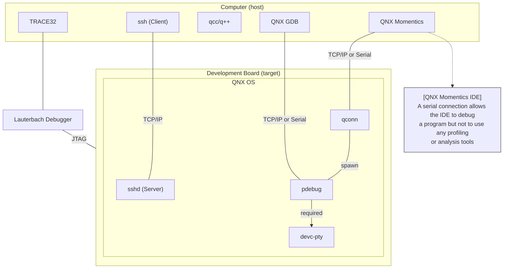

# Development Environment

```mermaid
graph TD
    subgraph "Computer (host)"
        ide["QNX Momentics"]
        gdb["QNX GDB"]
        compiler["qcc/q++"]
        ssh["ssh (Client)"]
        t32["TRACE32"]
    end

    subgraph devboard["Development Board (target)"]
        subgraph "QNX OS"
            sshd["sshd (Server)"]
            pdebug["pdebug"]
            devc_pty["devc-pty"]
            qconn["qconn"]
        end
    end

    debugger["Lauterbach Debugger"]

    ssh ---|"TCP/IP"| sshd
    ide ---|"TCP/IP or Serial"| qconn
    qconn ---|"spawn"| pdebug
    gdb ---|"TCP/IP or Serial"| pdebug
    pdebug -- "required" --> devc_pty
    t32 --- debugger
    debugger ---|"JTAG"| devboard
    
    note_ide["[QNX Momentics IDE]<br>A serial connection allows the IDE to debug<br>a program but not to use any profiling<br>or analysis tools"]
    ide -.-> note_ide

    style note_ide fill:#lightyellow,stroke:#333,stroke-width:1px
```
