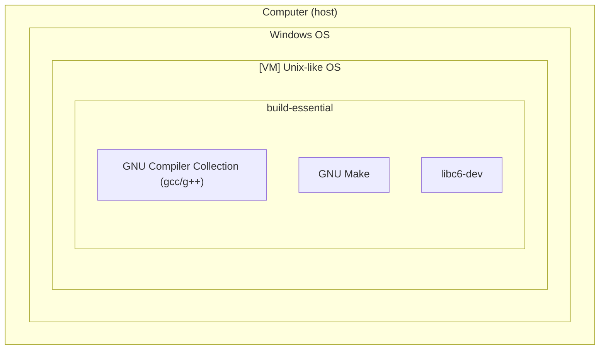

# Training Environment

```mermaid
graph TD
    subgraph "Computer (host)"
        subgraph "Windows OS"
            subgraph "[VM] Unix-like OS"
                subgraph "build-essential"
                    gcc["GNU Compiler Collection (gcc/g++)"]
                    make["GNU Make"]
                    libc["libc6-dev"]
                end
            end
        end
    end
```
