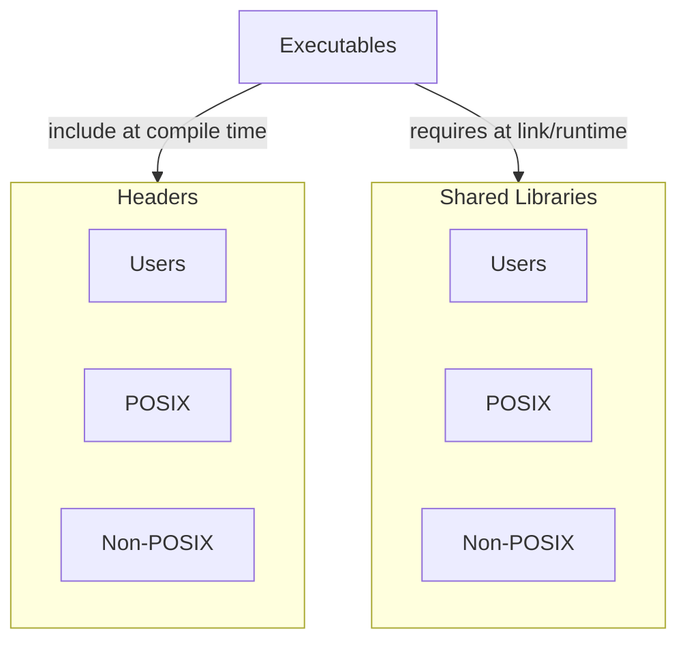

# Executables & Shared Libraries

```mermaid
graph TD
    subgraph Headers
        h_usr["Users"]
        h_posix["POSIX"]
        h_nposix["Non-POSIX"]
    end
    subgraph dlib["Shared Libraries"]
        d_usr["Users"]
        d_posix["POSIX"]
        d_nposix["Non-POSIX"]
    end
    exec["Executables"]
    exec --"include at compile time"--> Headers
    exec --"requires at link/runtime"--> dlib
```
