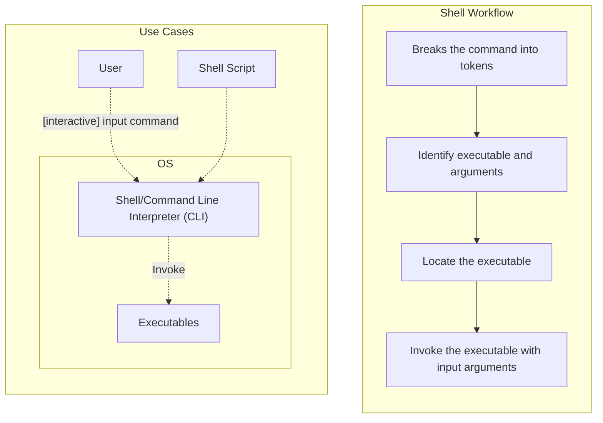

# What is Shell/Command Line Interpreter?

```mermaid
graph TD
    subgraph "Shell Workflow"
        direction TB
        s1["Breaks the command into tokens"]
        s2["Identify executable and arguments"]
        s3["Locate the executable"]
        s4["Invoke the executable with input arguments"]

        s1 --> s2
        s2 --> s3
        s3 --> s4
    end

    subgraph "Use Cases"
        direction TB
        user["User"]
        script["Shell Script"]

        subgraph "OS"
            shell["Shell/Command Line Interpreter (CLI)"]
            apps["Executables"]
        end

        user -.->|"[interactive] input command"| shell
        script -.-> shell
        shell -.->|"Invoke"| apps
    end
```
